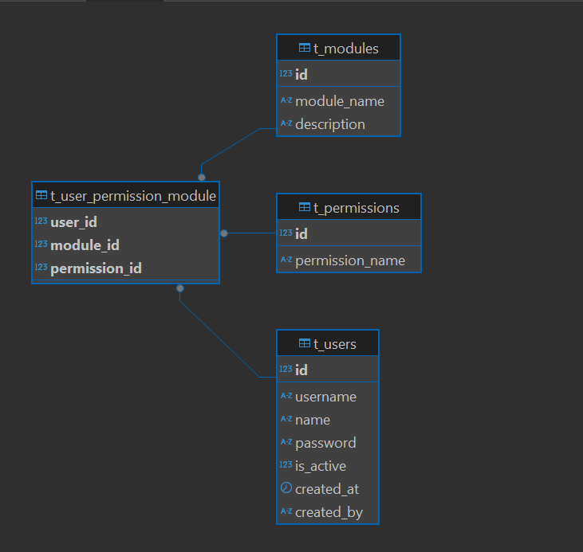

# ASSET MANAGEMENT API
    - FEATURES/USERS (4/10/2025) 

## DATABASE RELATIONAL
### User Relational

# ENDPOINT API

## api/user/ [POST]
- TOKEN : REQUIRED
- Description : Create new user with access previleges

### REQUEST
    {
        "username"      : "Testing 1",
        "password"      : "Testing 1",
        "name"          : "Testing 1",
        "created_by"    : "User Exists",
        "modules"       : [
            {"module_id" : 1, "permission_id" : 1},
            {"module_id" : 1, "permission_id" : 2},
            {"module_id" : 1, "permission_id" : 3},
            {"module_id" : 1, "permission_id" : 4},
        ]
    }
### RESPONSE
    {
        "status": "Successfully created new user",
        "data": {
            "id": 8,
            "username": "Testing5",
            "name": "Testing5",
            "is_active": 1,
            "created_at": "2025-10-04T20:35:31.000Z"
        }
    }

## api/user/ [GET]
- TOKEN : REQUIRED
- Description : Get all user

### RESPONSE
    {
        "status": "Successfully get all user",
        "data": [
        {
            "id": 4,
            "username": "TESTING2",
            "name": "TESTING2",
            "is_active": 1,
            "created_at": "2025-10-04T02:29:25.000Z"
        },
        {
            "id": 6,
            "username": "Testing3",
            "name": "Testing3",
            "is_active": 1,
            "created_at": "2025-10-04T20:32:58.000Z"
        },
        {
            "id": 7,
            "username": "Testing4",
            "name": "Testing4",
            "is_active": 1,
            "created_at": "2025-10-04T20:34:18.000Z"
        },
        {
            "id": 8,
            "username": "Testing5",
            "name": "Testing5",
            "is_active": 1,
            "created_at": "2025-10-04T20:35:31.000Z"
        }
        ]
    }

## api/user/$id [GET]
- TOKEN : REQUIRED
- Description : Get user by id user

### RESPONSE
    {
        "status": "Successfully get user",
        "data": {
            "id": 7,
            "username": "Testing4",
            "name": "Testing4",
            "is_active": 1,
            "created_at": "2025-10-04T20:34:18.000Z"
        }
    }

## api/user/$id [PUT]
- TOKEN : REQUIRED
- Description : Update status user with access previleges

### REQUEST
    {
        "is_active" : 0
    }

### RESPONSE
    {
        "status": "Successfully update status user",
        "data": {
            "id": 7,
            "username": "Testing4",
            "name": "Testing4",
            "is_active": 0,
            "created_at": "2025-10-04T20:34:18.000Z"
        }
    }

## api/user/$id [PATCH]
- TOKEN : REQUIRED
- Description : Change password user with access previleges

### REQUEST
    {
        "password" : "Password By Admin"
    }

### RESPONSE
    {
        "status": "Successfully update user",
        "data": {
            "id": 7,
            "username": "Testing4",
            "name": "Testing4",
            "is_active": 0,
            "created_at": "2025-10-04T20:34:18.000Z"
        }
    }

## api/login/ [POST]
- Description : Login User

### REQUEST
    {
        "username" : "TESTING",
        "password" : "Testing Password"
    }

### RESPONSE
    {
        "status": "Successfully update user",
        "token": "InR5cCI6IkpXVCJ9eyJpZCI6MSwiaWF0IjoxNzU5NTg0MzIxLCJleHAiOj",
        "data": {
            "id": 7,
            "username": "Testing4",
            "name": "Testing4",
            "modules": [
                "ASSET MASTER_CREATE",
                "ASSET MASTER_DELETE",
                "ASSET MASTER_READ",
                "ASSET MASTER_UPDATE"
            ]
        }
    }

## api/change_password/ [PUT]
- TOKEN : REQUIRED
- Description : Change password user 

### REQUEST
    {
        "username" : "TESTING",
        "password" : "Testing Password"
        "new_password" : "New Password"
    }

### RESPONSE
    {
        "status": "Successfully change password, please re-login",
    }